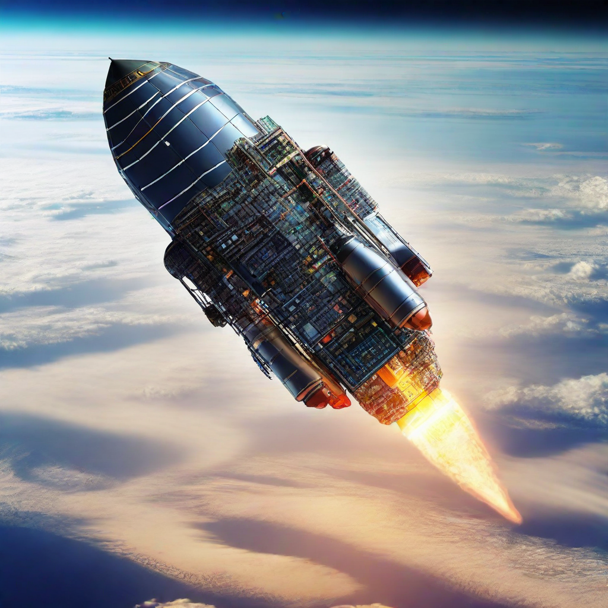

<head>
    
</head>

# The Stellar Synthnav Program
</img>
## About us (just me rn)
Space is the final frontier as we all know, and space is also big... Really big! This makes it hard for unmanned crafts to operate on celestial bodies far from Earth.
Therefore, We have created the SSP. The goal of the SSP is to create AI capable of navigating in space by the creation of accurate to scale models of the solar system,
and then training and testing AI powered craft in said simulations for potential real life purposes.
